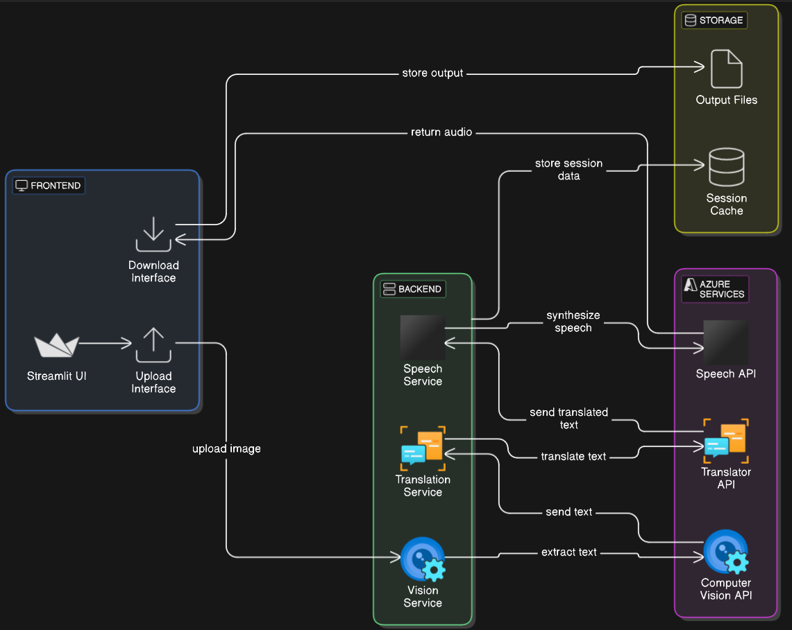
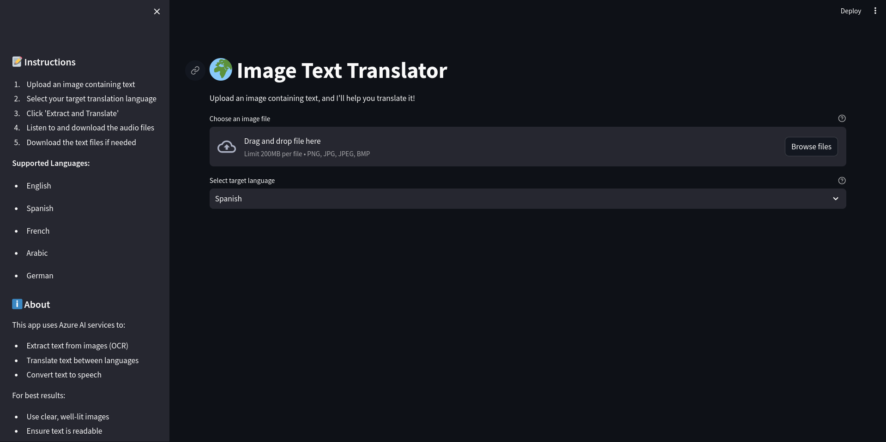
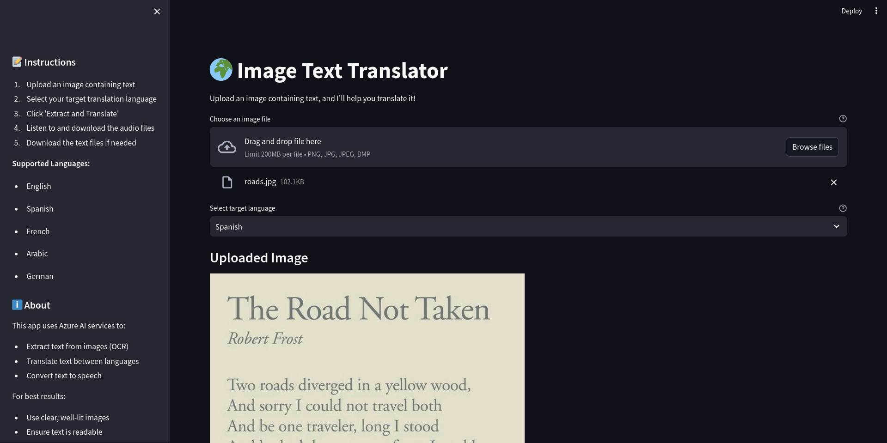
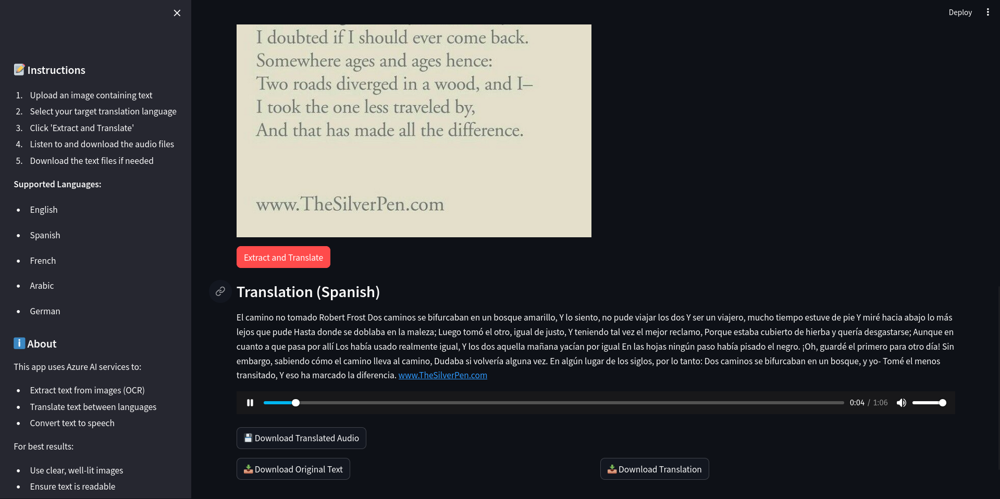
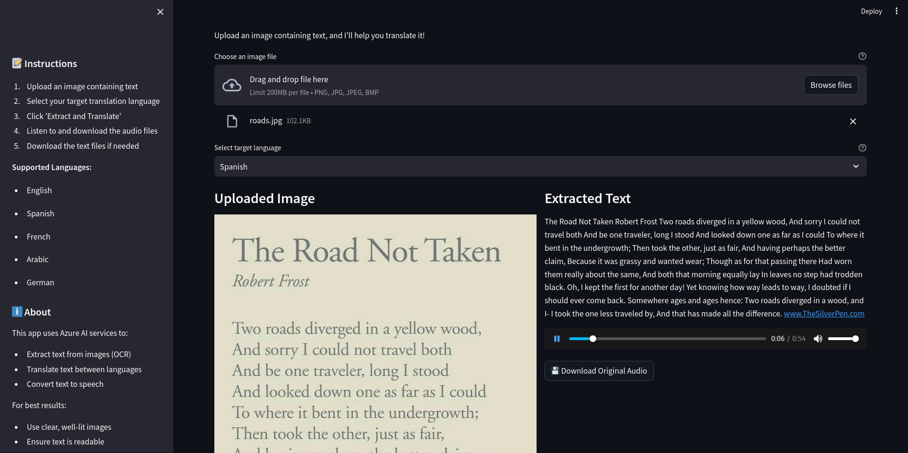
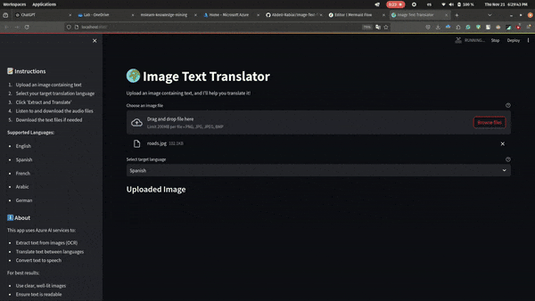

# Image-Text-Translator 🌍

Real-time image translation platform leveraging Azure Cognitive Services for text extraction, translation, and speech synthesis.

## Technical Architecture

### Core Components
- Frontend: Streamlit web interface
- Backend: Python services integration
- Azure Services: Computer Vision, Translator, Speech Services


### Application Screenshots
####  Cloud architecture
cloud_architecture diagram


flow chart diagram


#### User Interfaces
main page


image processing / upload image


translated text and audio to the targeted language


original language text and audio


### Demo Video

This GIF demonstrates the key features of the Image Text Translator project.


## Azure Services Setup

### 1. Computer Vision
```bash
az cognitiveservices account create \
    --name "image-translator-vision" \
    --resource-group "your-rg" \
    --kind "ComputerVision" \
    --sku "F0" \
    --location "eastus" \
    --yes
```

### 2. Translator
```bash
az cognitiveservices account create \
    --name "image-translator-text" \
    --resource-group "your-rg" \
    --kind "TextTranslation" \
    --sku "F0" \
    --location "global" \
    --yes
```

### 3. Speech Services
```bash
az cognitiveservices account create \
    --name "image-translator-speech" \
    --resource-group "your-rg" \
    --kind "SpeechServices" \
    --sku "F0" \
    --location "eastus" \
    --yes
```

## Project Setup

### Environment Configuration
1. Clone repository:
```bash
git clone https://github.com/yourusername/Image-Text-Translator.git
cd Image-Text-Translator
```

2. Create virtual environment:
```bash
python -m venv venv
source venv/bin/activate  # Linux/Mac
# or
venv\Scripts\activate     # Windows
```

3. Install dependencies:
```bash
pip install -r requirements.txt
```

4. Configure .env:
```env
AZURE_VISION_KEY=<vision-key>
AZURE_VISION_ENDPOINT=<vision-service-endpoint>
AZURE_TRANSLATOR_KEY=<translator-key>
AZURE_TRANSLATOR_REGION=<region>
AZURE_SPEECH_KEY=<speech-key>
AZURE_SPEECH_REGION=<region>
```

## Project Structure
```
azure_translation_app/
├── backend/                 # Core services
│   ├── vision_service.py    # OCR functionality
│   ├── translator_service.py # Translation service
│   └── speech_service.py    # Text-to-speech service
├── tests/                   # Test suite
│   ├── test_vision.py
│   ├── test_translator.py
│   └── test_speech.py
├── images/                  # Test images
├── output/                  # Generated files
├── app.py                   # Streamlit interface
└── requirements.txt
```


## Running the Application

### Development Server
```bash
streamlit run app.py
```

### Testing
```bash
# Test individual services
python tests/test_vision.py
python tests/test_translator.py
python tests/test_speech.py

# Full pipeline test
python tests/test_all_services.py
```

## Features
- OCR text extraction from images
- Multi-language translation support
- Neural text-to-speech synthesis
- Audio file generation and download
- Support for multiple image formats
- Real-time processing

## Supported Languages
- English (en-US)
- Spanish (es-ES)
- French (fr-FR)
- Arabic (ar-SA)
- German (de-DE)

## Technical Specifications
- Python 3.10+
- Azure Computer Vision v3.2
- Neural Machine Translation
- Neural Text-to-Speech synthesis
- Streamlit web framework
- PIL image processing

## Performance Optimizations
- Session state management
- Asynchronous processing
- Caching mechanisms
- Error handling with graceful degradation


## Contact
Abdelouahed rabiai - abdell.rabiai@gmail.com
Project Link: https://github.com/yourusername/Image-Text-Translator